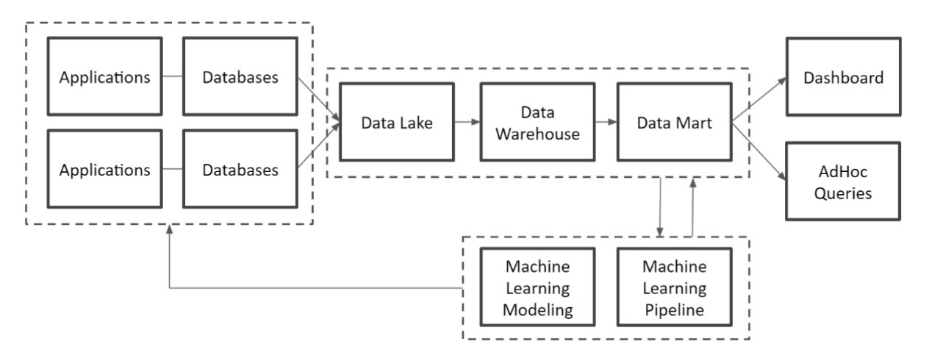
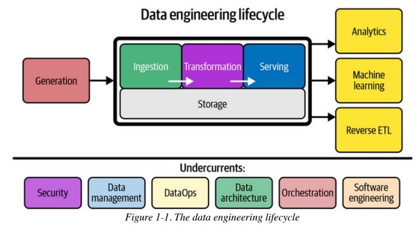
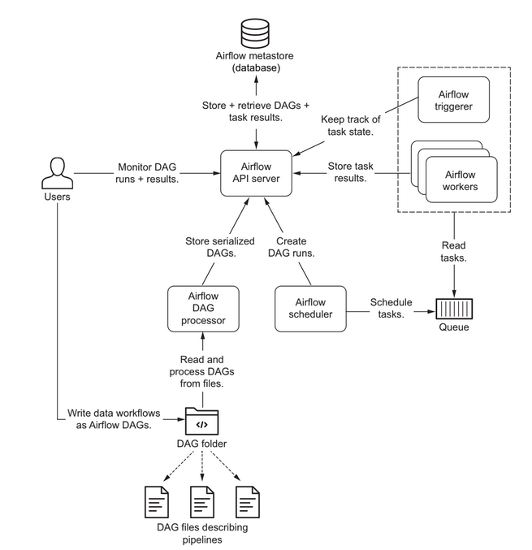
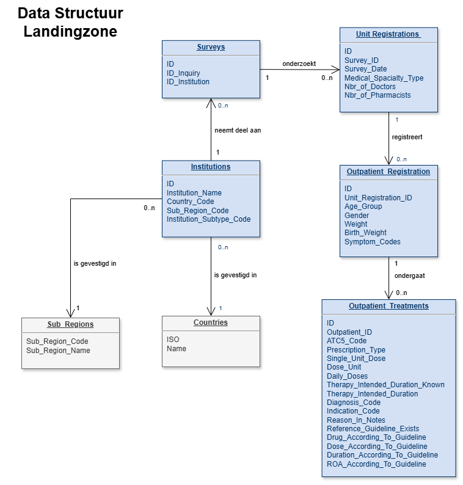
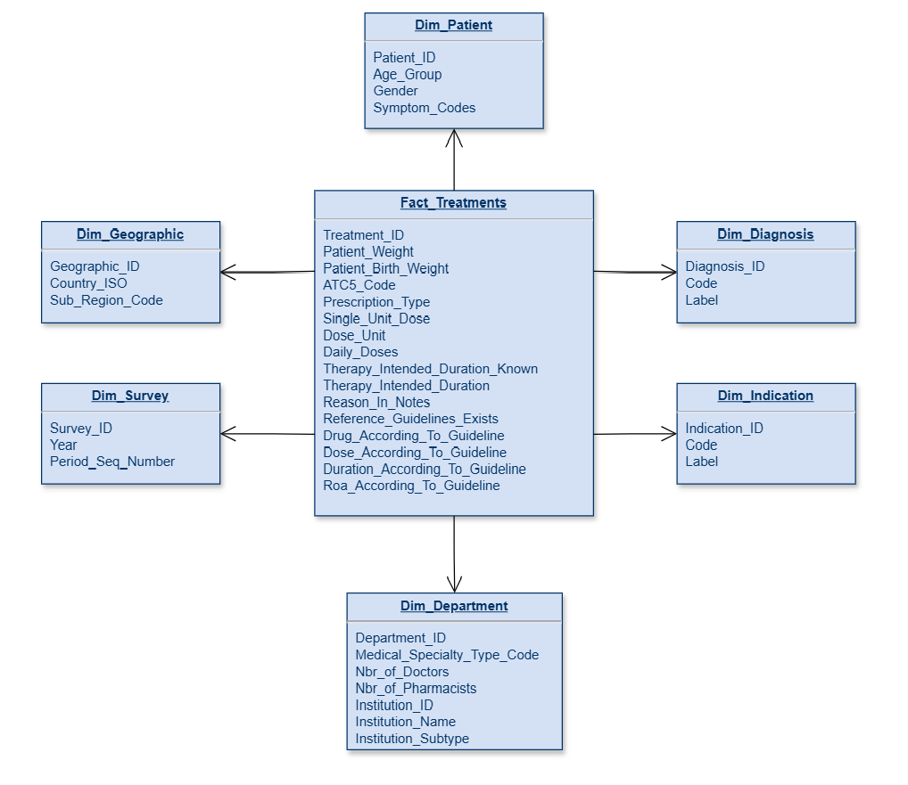

# Data-Engineering Project (2025-2026)
## Inhoudstafel
- Inleidend
- Plan van aanpak
- Architecturaal
	- Algemeen
	- Beschrijving architectuur
		- Duiding
		- Architectuur
	- Patronen
		- Datawarehouse architectuur
		- Orchestration
- Technisch Ontwerp
	- Staging Area
	- Orchestrator
	- Datawarehouse
	- Document Database
	- Google Cloud
- Implementation
	- FTP Server
	- Apache Airflow
- Journal
- Geraadpleegde bronnen

## Inleidend
Dit is een 'Work In Progress'-document en zal aan veranderingen onderhevig zijn. Bedoeling van dit document is om een high-level overzicht te geven van de technische opzet van het project. Tevens zullen er secties opgenomen worden waarin de progressie van het project beschreven wordt (zie sectie Journal). Dit zal twee aspecten bevatten, enerzijds de activiteiten inzake de geïmplementeerde code & configuratie met wat technische duiding, anderzijds het verloop van de opzet. Het laatste aspect dient inzicht te geven in de aanpak, welke concepten tegengekomen zijn, wat de moeilijkere aspecten waren en tenslotte bronverwijzingen.
Om de tekst niet al te zwaar te maken zullen de meeste zaken als bullet points genoteerd worden.

## Plan van aanpak
In eerste instantie had ik een 4-tal fases gedefinieerd die ik zou volgen, startende met een eenvoudige Docker setup. Echter tijdens de ontwikkeling van bedrijfsprojecten wordt meestal in het begin van het project een aantal use cases geïdentificeerd die als risicovol worden aanzien. Deze worden dan reeds in de elaboration phase ontwikkeld zodat de risico's zo snel mogelijk worden gemitigeerd (of indien nodig, kan men vooraan het ontwikkelproces nog de nodige aanpassingen/alternatieven voorzien). Daarom heb ik besloten om een aantal technische integraties behorende tot de minimale opzet naar het begin van het ontwikkelproces te verplaatsen. Het gevolg is dat Apache Airflow naar voor is getrokken.

## Architecturaal
### Algemeen
Deze sectie bevat informatie betreffende de architecturale opzet van het project. Dit is dus een high-level beschrijving. Voor verdere details zijn er andere secties in het document opgenomen.
### Beschrijving architectuur
#### Duiding
Het project is gebaseerd op de werking van een bestaande onderzoeksgroep aan de Universiteit Antwerpen behorende tot de faculteit Geneeskunde en gezondheidswetenschappen. De onderzoeksgroep verzamelt gegevens van ziekenhuizen wereldwijd in het kader van antimicrobiële resistentie. Op basis van deze gegevens kunnen analyses gemaakt worden die dan op hun beurt gebruikt kunnen worden voor Antimicrobial Stewardship. Dit alles met het oog op problematiek inzake antimicrobiële resistentie in te dammen. 
De opzet is voorlopig vrij eenvoudig. Via een webapplicatie kunnen ziekenhuizen wereldwijd data ingeven aan de hand van een opgezet Point-Prevalence-Survey dat een bepaald protocol volgt. Het protocol/PPS bevat gegevens mbt. patiënt -en behandelgegevens in het kader van de bestrijding van antimicrobiële resistentie. Deze gegevens worden in een OLTP RDBMS opgeslagen. De bedoeling is dat deze gegevens getransformeerd gaan worden met twee doeleinden in het vooruitzicht:
- Data Scientists en onderzoekers gegevens aanreiken in een formaat dat makkelijk te gebruiken is de R-code voor statistisch onderzoek
- Data Sharing met externe partners (WHO, andere universiteiten/wetenschappelijke instellingen)
Bedoeling is om een data-architectuur op te zetten waarbij gegevens geëxtraheerd, getransformeerd en opgeladen worden naar een formaat dat voldoet aan de eisen van de bovenstaande partijen.
Belangrijk: de implementatie van het project zal een sterk vereenvoudigde opzet zijn van wat er in realiteit geïmplementeerd gaat worden. De finale opzet dient nog verder uitgewerkt te worden. Deze zal elementen bevatten zoals Database Replication. Binnen deze project opzet zal dit weggelaten worden en gaan we uit van een Staging Area waar we files opzetten die dan een (partiële) weerspiegeling zal zijn van de gegevens uit de OLTP Database.
#### Architectuur
De **vereenvoudigde** opzet zal bestaan uit een aantal componenten die via Docker-compose opgezet worden (Single Host):
- FTP Server zal fungeren als een Staging Area.
	- Hier zullen bestanden op komen te staan die:
		- De input gaan vormen voor het ELT proces om deze data te converteren naar de gewenste formaten
		- Output bestanden die het resultaat zijn van bepaalde verwerkingen (Reverse ETL)
	- Dit is erg relatief en men zou dit kunnen zien als een '(very) poor man's Datalake'
	- Een alternatief hiervoor zou het gebruik zijn van Apache Iceberg of Google dataproc op het Google Cloud Platform
	- Nadelen FTP Server 'als datalake':
		- Weinig ondersteuning voor data governance
		- Geen fine-grained security
		- Geen opslag van meta-data (geen data-lineage...)
		- Geen mogelijkheid om queries uit te voeren om objecten/files op te zoeken
	- FTP Server gebruiken als datalake kan dan ook al snel leiden tot een data swamp
- Apache Airflow
	- Orchestrator die het ELT proces voor zijn rekening neemt
	- Zal bestanden ophalen van de FTP Server
	- Vervolgens zal dit bestand verder in de flow worden verwerkt:
		- Data Cleaning
		- Data Transformation
		- Data Enrichment
	- Het opgeschoonde bestand zal worden weggeschreven naar disk ((voorlopig) een bind mount met de host)
		- Dit zal een Docker mount bind zijn zodat het resultaat bewaard blijft nadat de containers vernietigd worden
		- Opmerking: de Airflow workers zullen access hebben tot dit bestand. Dit wil zeggen dat we in principe zouden geconfronteerd kunnen worden met race conditions. Ik veronderstel dat het Airflow proces zo ingericht kan worden dat er slechts 1 Airflow Worker tegelijk het bestand kan verwerken
	-Subcomponenten Airflow
		- PostgreSQL Database (bevat de meta-data over de Apache Airflow opzet en concrete Flows)
		- Redis
- PostgreSQL
	- Opgelet: dit is niet de Apache Airflow instance
	- Deze database instance zal fungeren als een Datawarehouse
	- Normaliter worden er hier technologieën gebruikt als Snowflake of Teradata. Echter de dataset is relatief klein en zodus zou PostgreSQL hiervoor dienen te volstaan
	- Opmerking: ook in de specifieke realiteit van de onderzoeksgroep zal er hiervoor een RDBMS gebruikt worden. Twee redenen:
		- De dataset is relatief klein
		- De financiële situatie van de onderzoeksgroep laat niet toe al te dure investeringen te doen
- MongoDB
	- Bedoeling is ook om documents (aggregated content) op te slaan
	- Opmerking: deze case is gekozen voor educatieve doeleinden. In de specifieke realiteit van het project is er voorlopig geen vraag naar (alhoewel dit best in de toekomst wel het geval zou kunnen zijn)
- Cloud Storage/DB
	- Er zal een data transfer gedaan worden naar een Cloud Database zodat externe partners Reporting/Analytics/AI-tooling in de Cloud kunnen loslaten op de gegevens
	- In eerste instantie gaat de voorkeur van het project uit naar Google Cloud Storage & BigQuery
		- Azure zou een alternatief kunnen vormen
- MCP Servers (optioneel)
	- Koppeling MCP server met datawarehouse
	- TODO: zit in experimentele fase
- Vector Database (Optioneel)
	- Zou documenten kunnen bevatten mbt. het protocol en de tooling
	- Zou gekoppeld kunnen worden aan een LLM (lokaal of in de cloud) zodat eindgebruikers van ziekenhuizen en externe partners vragen kunnen stellen
	- RAG & LLM (Retrieval-Augmented Generation)
- AI Agent systeem (optioneel)
	- TO DO: dieper bekijken
Opmerking: in het project draait alles op één host. In realiteit zal dit uiteraard verdeeld worden over meerdere hosts/clusters.
### Patronen
Er zijn een aantal architecturale patronen die steeds terugkomen.
#### Datawarehouse Architectuur
- Input bronnen (CRM, OLTP RDBMS,...)
- Staging Area (input bronnen worden (via ETL) overgezet naar de Staging Area)
	- Dit bevat nog de 'ruwe data'
	- Dit kan een Data Lake zijn
- Deze ruwe data wordt vervolgens 'opgeschoond'
- Vervolgens zal deze via het ETL proces worden opgeladen naar het Datawarehouse
- Aan het Datawarehouse zullen Data Marts gekoppeld worden
	- Data Marts is een deelverzameling van een Datawarehouse en is gericht op één specifieke afdeling of business domain
	- Deze Data Marts zullen gebruikt worden door Data science tools, Frontend tools, Dashboards,...

**Schematisch**



(uit: Data Engineering with Google Cloud Platform - Adi Wijaya - 2024)

- Er zijn verschillende manieren om data te modelleren in Datawarehouses.
- Kimball vs Inmon vs Data-Vault
	- Kimball
		- Zal gebruik maken van gedenormaliseerde sterschema's
		- Feiten-tabellen
		- Dimensie-tabellen
		- TODO: verder kort beschrijven
	- Inmon
		- Datawarehouse zal genormaliseerde data bevatten
		- TODO: verder kort beschrijven
	- Data-Vault
		- Mix tussen normalisatie en dimensioneel modeleren
		- TODO: verder kort beschrijven

#### Orchestration
- Om het ETL proces uit te voeren wordt er gebruik gemaakt van een Orchestration tool. Deze tool zal pipelines opzetten die een aantal systemen met mekaar in verbinding zal brengen. Uit sommige van deze systemen zal data geëxtraheerd worden om deze vervolgens te cleanen, transformeren, enrichen,... en op te slaan in een ander systeem. Een klassiek voorbeeld is het extraheren van data uit een OLTP RDBMS en deze te transformeren naar een gedenormalizeerde vorm die dan in een OLAP Database opgeladen/gepersisteerd zal worden.

**Schematisch**



(uit: Fundamentals of Data Engineering - Joe Reis - 2022)

- De tool die we gebruiken is Apache Airflow. Alternatieven zijn Prefect of Dagster.
- Er is geopteerd voor Apache Airflow omdat deze technologie een proven status heeft en omdat deze ook de standaard technologie is achter Google Composer (de orchestration tool in het Google Cloud Platform)
- De flow wordt gedefinieerd in DAGs waarbij een Scheduler de DAGs inlaadt en opstart. De logica gedefinieerd in de DAGs zal dan worden uitgevoerd door Workers
- Verder biedt Apache Airflow een aantal mogelijkheden om de flows te monitoren en grafisch weer te geven

**Schematisch**



(uit: Data Pipelines with Apache Airflow - Julian de Ruiter - 2026)

## Technisch Ontwerp
### Staging Area
- FTP Server opzet
	- SQL/JSON-Files/... => Data Lake (Ruwe data, Batch, Streaming -> Bewerkte data) => Data Marts, Data Scientists => Rapportering
	- Onderverdeling FTP (Folder structuur)
	```
		/Ruwe data 				/Bewerkte data
			/Bron1					/Project1
				/Tabel1					/Tabel1
				/Tabel2					/Tabel2
			/Bron2					/Project2
				/Tabel1					/Tabel1
				/Tabel2					/Tabel2
	```
	- Enkel de sectie Bewerkte data wordt opengesteld voor anderen die dan deze data kunnen gebruiken
	- Nota: voorzien we een mechanisme waar iedere file-upload wordt bewaard (met datum) voor debugging doeleinden (historiek)?

### Orchestrator
- Airflow zal het ETL proces aansturen dmv. het definiëren van flows via Directe Acyclic Graphs (DAGs)
- Er wordt gebruik gemaakt van een aangepaste Docker container zodat er bepaalde Python libraries opgenomen zijn die in de DAG code gebruikt kunnen worden
- TODO: verder uitschrijven

### Datawarehouse
- Er zal een klassieke RDBMS worden gebruikt die dienst zal doen als Datawarehouse
- Consumers: Data Scientists
- TODO: verder uitschrijven

### Document Database
- MongoDB zal fungeren als document store
- Consumers: externe partners
- TODO: verder uitschrijven

### Google Cloud (BigQuery)
- Deze database zal als Cloud Database fungeren
- Consumers: externe partners
- TODO: verder uitschrijven

## Data Model
### Landingzone
#### Structuur datamodel
Zoals eerder gesteld zal de landingzone een aantal CSV files bevatten die de data omspannen. Deze data is uit de OLTP database getrokken. De files volgen een bepaalde structuur die niet persé relationeel genormaliseerd is maar die een structuur zouden kunnen bevatten zoals datasets die aangeboden worden op het internet. De structuur is dus eerder bedoeld om in een educatief project te fungeren. Bedoeling is dat deze structuur getransformeerd zal worden (zie eerder).
Schema van het datamodel:



#### Verklaring datamodel
Hieronder staat een oplijsting van de aanwezige datasets met een high-level verklaring:
- Institutions
	- Bevat de hospitalen die deel hebben genomen aan bepaalde surveys. In dit geval gaat het om Outpatient Surveys. In deze tabel wordt een kleine dataset aan gegevens bijgehouden.
	- Duiding Kolommen:
		- Country-Code: in welk land is het instituut gevestigd
		- Sub-Region-Code: in welke subregio in de wereld is het hospitaal gevestigd
		- Subtype-Code: wat voor soort hospitaal is het (primair, secundair...)
- Surveys
	- Een hospitaal dat meedoet aan een Point-Prevalence-Survey zal een protocol volgen om op bepaalde tijdstippen (survey-date) de patiënten te monitoren en alle gegevens mbt. deze patiënt en zijn behandeling te registreren. Bedoeling is dat er een strikt protocol gevolgd wordt voor de data te verzamelen voor elke patiënt op de betreffende survey-date. Aan een Survey zullen dus onderzoekgegevens gekoppeld worden.
	- Duiding kolommen:
		- Inquiry-Id: per jaar worden er een aantal inquiries uitgeschreven. Dit zijn periodes waarin er surveys kunnen gebeuren
		- Institution-Id: de ID van het institution waarop de survey betrekking heeft
- Unit-Registrations
	- Er gebeuren registraties op bepaalde departementen van een hospitaal/medical care facility = Units. Patiënten waarvoor men registraties gaat doen zullen binnen een bepaalde Unit behandeld worden. Van deze Unit worden ook een aantal gegevens bijgehouden
	- Duiding kolommen:
		- Survey-ID: met welke survey is deze Unit-Registration gekoppeld
		- Survey-Date: datum waarop de survey gebeurd binnen deze unit
		- Medical Specialty Type: wat is de specialiteit van deze Unit (vb. Neurologie)
		- Nbr-of-doctors: aantal doctors gelieerd aan deze unit
		- Nbr-of-Pharmacists: aantal pharmaceuten gelieerd aan deze unit
- Outpatient-Registrations
	- Tijdens een survey worden gegevens genoteerd van de patiënten die gesurveyeerd worden.
	- Duiding kolommen
		- Unit-registration-ID: aan welke Unit is de patiënt gekoppeld
		- Age-group: wat is de leeftijdscategorie van de patiënt (neonaat, kind, volwassene)
		- Gender: gender van de patiënt
		- Weight: gewicht
		- Birth-Weight: gewicht van een neonaat
		- Symptom-codes: codes voor symptomen dat de patiënt vertoond (1 of meerdere gescheiden van mekaar door een pipe)
- Outpatient-Treatments
	- Er gebeuren 2 soorten registraties:
		- Algemene registraties: er wordt geen bijkomende data genoteerd (enkel een aantal basis patiënt gegevens). Dit soort registratie wordt gedaan als er geen antimicrobial wordt voorgeschreven. Deze patiënt wordt wel geregistreerd oa. omwille van het feit dat we willen weten hoeveel patiënten er in totaal zijn gesurveyeerd tov. het aantal patiënten dat een antimicrobial heeft gekregen
		- Detail registratie: hier worden extra gegevens genoteerd, oa. de treatment gegevens. Deze patiënten hebben wel een antimicrobial voorgeschreven gekregen. Merk op dat er meerdere antimicrobials voorgeschreven kunnen worden. Voor elk antimicrobial dat voorgeschreven wordt zal er een Treatment worden geregistreerd
	- Duiding kolommen:
		- Outpatient-Id: aan welke patiënt is de behandeling gelieerd
		- ACT5-Code: de code die het antimicrobial (antibioticum, antiviraal, antifungal) weerspiegelt (classificatie)
		- Prescription-type: soort voorschrift (opstart van behandeling, een voorschrift voor een lopende behandeling,...)
		- Single Unit Dose: dosering van een unit (vb. 1 pilletje)
		- Dose Unit: eenheid (mg, gram, microliter,...)
		- Daily Doses: aantal dosissen per dag
		- Therapy Intended Duration Known: is de duur van de behandeling gekend
		- Therapy Duration: duur van de behandeling
		- Diagnosis-Code: code van de gestelde diagnose (apart classificatiesysteem specifiek aan het project)
		- Indication-Code: waar heeft de patiênt de infectie opgedaan (thuis, in het ziekenhuis,...)
		- Reason in notes: staat de rede voor het toedienen van het antimicrobial in het dossier van de patiënt
		- Reference Guideline Exists: is er een richtlijn aanwezig voor het gebruik van het verstrekte antimicrobial
		- Drug According To Guideline: is het toegediende antimicrobial effectief volgens de richtlijn voor het gebruik ervan
		- Dose According to Guideline: stemt de dosis die gegeven is overeen met de richtlijn
		- Duration According to Guideline: stemt de duur van de behandeling overeen met de richtlijn
		- ROA According to Guideline: is de manier van toedienen (oraal, parenteraal,...) volgens de richtlijn
- Countries (ondersteuningstabel)
	- Bevat code en naam van landen (institution refereert hiernaar)
- Subregions (ondersteuningstabel)
	- Bevat code en naam van de region (institution refereert hiernaar)

### Datawarehouse/OLAP Model
#### Structuur model
TODO: beschrijving analyse



## Implementatie
### FTP Server
- FTP opzet duiding
	- Passieve poorten zijn de poorten voor bestandsoverdracht
	- curl zal een poort openen voor de data-overdracht en opent daarvoor een extra WILLEKEURIGE poort
	- Deze extra poort komt uit de voorgestelde passive port range
	- Poort 21 is de controle poort (voor commando's)
	- Passieve poort: nodig voor data overdracht
	- Docker setup
		- docker volume create ftp_volume
	- Curl voorbeeld instructies voor download bestand
		- curl -u airflow:airflow ftp://127.0.0.1/test.txt -o test.txt
		- curl -v --ftp-pasv -u airflow:airflow ftp://127.0.0.1/test.txt -o test.txt
	- docker compose -f ftpserver.yml up -d
### Apache Airflow
- Installatie via Docker Compose
	- Installatie procedure: https://airflow.apache.org/docs/apache-airflow/stable/howto/docker-compose/index.html
	- Maakt account aan
- Als er problemen zijn dan clean up en restart van scratch
	- zie 'Cleaning-up the environment'-sectie in link installatie procedure
- Test opzet via de command line
	- docker compose run airflow-worker airflow info
- Url access GUI van Airflow: http://localhost:8080
- Om eigen image te maken met bijvoorbeeld extra python libraries:
	- Zie section: 'Special case - adding dependencies via requirements.txt file' in install document (zie boven)
- Resources voor gebruik FT Operaties via connectors
	- FTP Turorial: https://www.sparkcodehub.com/airflow/operators/ftp-operator
	- FTP Operator: https://airflow.apache.org/docs/apache-airflow-providers-ftp/stable/operators/index.html
- Postgres
	- Aanpassing in docker om port te exposen zodat deze extern kan benaderd worden
	- Makkelijker tijdens development om te zien wat er opgeslagen wordt inzake Apache Airflow flow configuraties (vb. bij aanmaak FTP connectie)
	- Configuratie van FTP connection staat in database (gecheckt)
- Aanloggen container van een Airflow Worker
	- Opstart: docker exec -it XXXXX bash    (met XXXXX = container id van airflow-worker)
- Connection aanmaken
	- UI
	- CLI: airflow connections add 'ftp_server' --conn-json '{ "conn_type": "ftp", "login": "airflow", "password": "airflow", "host": "localhost", "port": 21, "schema": "" }'
- Python packages
	- Om te zien welke python packages er geïnstalleerd staan:
		- Log in op een docker container van een airflow worker (zie boven)
		- Run commando: pip freeze
- Installatie IDE
	- VS Code
	- Er is reeds een dag directory onder de airflow folder voorzien tijdens de opzet van airflow
	- Ga in de project dir staan en open terminal:
		- python3 -m venv venv
		- source venv/bin/activate
		- pip install "apache-airflow[celery,ftp]==3.1.7"
		- selecteer de interpretere in je Visual Studio (CTRL-SHFT-P -> select interpreter -> selecteer venv)
- Opzetten eenvoudige DAG
	- https://airflow.apache.org/docs/apache-airflow/stable/tutorial/fundamentals.html
- Codering Test FTP Dag
	- Resource: https://www.sparkcodehub.com/airflow/operators/ftp-operator
	- Aanmaak docker networks
		- docker network create landingzone
		- docker network create orchestration
	- Aanpassing docker-compose files
	- Aanpassing ftp connection in airflow zodat deze verwijst naar de docker service naam van de ftpserver
	- Aanpassing code
	- Testen
- Hoe testen te draaien van functions in een DAG
	-https://www.geeksforgeeks.org/python/function-annotations-python/   (zie wrapper)
- Link vanuit Python naar Database
	- https://realpython.com/python-sql-libraries/#postgresql
	- https://www.geeksforgeeks.org/python/postgresql-python-querying-data/
	- psycopg library voor PostgreSQL te benaderen: https://www.psycopg.org/docs/usage.html
	- Opmerking: alternatief zou zijn: SQLAlchemy
- Link export DataFrame naar Database via Pandas	
	- https://pandas.pydata.org/docs/user_guide/io.html#sql-queries
- Integratie MongoDB
	- Basis opzet connectiviteit
		- https://www.mongodb.com/docs/languages/python/pymongo-driver/current/connect/
	- Pandas conversion df to json
		- https://docs.vultr.com/python/third-party/pandas/DataFrame/to_json
	- Basis data manipulatie MongoDB & Python
		- https://www.geeksforgeeks.org/mongodb/mongodb-python-insert-update-data/
### Google BigQuery
- Opzet project in Google Cloud workspace
- Opzet Service Account voor tools die via API Google Cloud willen aanspreken
	- Service account jkeustermans aangemaakt als BigQuery Admin. Procdure:
		- Log aan in Google Cloud Dashboard
		- Ga naar IAM and services
		- Create Service Account
		- Vul basisvelden in
		- Maak een nieuwe key aan
		- Key verschijnt in de lijst
		- Ga naar de details van nieuwe key
		- Daarna naar Keys tabblad gaan
		- Add key > Create new key
		- Kies JSON
		- Er wordt automatisch een key gedownload naar je lokale schijf
	- Resource: https://blog.dataengineerthings.org/setting-up-a-google-cloud-service-account-with-json-key-for-authentication-d673e10ea8e7
- Dependency opnemen in Airflow voor aanspreken API Google Cloud
	- pip install google-cloud-BigQuery
	- Maak een nieuwe image aan voor Apache Airflow
- Implementatie code in Airflow
	- Resource: https://blog.coupler.io/how-to-crud-bigquery-with-python/

## Journal
### Week 16 feb
- Opzet & Config lightweight ftp server (Docker)
- Testen FTP server via curl
	- Uitzoeken gebruik curl mbt. ftp transmissies (oa. command vs passieve ports)
- Opzet Airflow (Docker Compose)
	- Geen problemen tegengekomen met opzet
- Testen Airflow
	- Web UI
	- Command Line instructies specifiek aan Airflow
- Connection FTP server aanmaken in Airflow via UI en CLI
- Aanpassing opzet zodat PostgreSQL port exposed is en accessable is buiten container
	- Educatieve/Development doeleinden, geen PRD instelling
- Aanmaak gezamenlijke docker networks
- Integratie VS Code voor coderen DAGs in IDE
- Opzet eenvoudige Test-DAG (op basis van internet resource)
- Opzet DAGs voor upload en download van data naar FTP server vanaf Airflow
	- Problemen: configuratie heeft wel wat tijd in beslag genomen omdat bestanden en paden niet gevonden werden
	- Oplossing: aanpassing in docker compose file inzake bind mount
- Aanmaak folderstructuur FTP server (inbound, outbound)
- Opzet GitHub repository
	- Inchecken project
- Opzet basis directory structuur in FTP server en mount bind met host in apache airflow
	- Aanpassing configuratie docker & aanpassing DAG
	- Testen
- Refactoring: introductie annotations voor PythonOperator
	- Nieuwere syntax is met decorators/annotations in de code
- Toevoegen test verwerking van gedownloade file
- Toevoegen extra PostgreSQL database instance die zal fungeren als een Datawarehouse + initialisatie script db voor aanmaak schema & test table
- Aanmaak custom Dockerbuild file + aanpassing Docker Compose voor opnemen PostgreSQL Python dependency in Apache Airflow
- Implementeren Python Task voor:
	- Uitlezen van de (via FTP) gedownloade csv file via Pandas framework
	- Introduceren gebruik Pandas: toevoegen van een (eevoudige) data cleaning
	- Wegschrijven gegevens van DataFrame naar DWH database
	- Integreren psycopg library voor PostgreSQL
### Week 23 feb
- Opzet MongoDB
	- Schrijven docker compose file
	- Opzet init script voorbereiding MongoDB
	- Testen opzet
	- Aandachtspunt: MongoDB docker dient deel uit te maken van hetzelfde docker netwerk als Apache Airflow
- Integratie mongodb in Airflow proces
	- Opnemen extra library pymongo in Airflow container (rebuild image)
	- Uitzoeken connectie vanuit Python naar MongoDB en toevoegen document aan MongoDB collection
	- Uitbreiden code DAG voor eenvoudige verwerking csv file
	- Testen opzet lokaal (Python)
	- Testen opzet in Airflow
- Experimenteel
	- Geëxperimenteerd met aantal concepten die eventueel in latere instantie opgenomen kunnen worden:
		- MCP/Lokale/LLM/Langchain
			- Technologieën
				- Lokale LLM installatie (Ollama - meerdere modellen)
					- Ollama (meerdere modellen: 3.1, 3.2 en qwen2.5-coder)
				- MCP Server
					- mcp library
				- Langchain
			- Opzet
				- Test Database opgezet (MySQL via docker compose)
				- Aantal test-scenario's geschreven: MCP scenario & Langchain scenario
				- Zie files onder experimenteel/mcp
			- Opmerkingen
				- De eerste resultaten zijn teleurstellend. Ik dien verder uit te zoeken waarom dit zo is. Eén van de factoren is wellicht mijn gebrek aan kennis omtrent MCP/inzet LLMs/... Een andere mogelijkheid is dat het model dat ik lokaal draai misschien niet krachtig genoeg is
				- De code is afkomstig uit online resources en verbetert adh van AI
				- Op moment van schrijven is de code niet volledig duidelijk voor mij zodus ik dien verder studiewerk hieromtrent uit te voeren
### Week 2 maart
- Uitbreiden en herwerken technische documentatie
- Studie Google BigQuery
	- Diagonaal/Partieel doornemen Data Engineering with Google Cloud Platform
	- Doornemen artikels
	- Uittesten UI Google Cloud
- Doornemen artikels voor meer duiding huidig data-engineering landschap (zie ook sectie Geraadpleegde bronnen)
	- What is a Data Lake? Definition, Architecture, and Use Cases
	- Apache Iceberg Explained: A Complete Guide for Beginners
	- Object Storage as Primary Storage: The MinIO Story
	- MinIO Docker: Setup guide for S3-Compatible Object Storage
- Implementatie basisscenario voor integratie BigQuery in Airflow workflow
	- Doornemen resources ivm. opzet:
		- Artikel opzet IAM account & key export
		- Artikel integratie Python en BigQuery
	- Opzetten Google Services Account (IAM)
	- Export key file + opzet configuratie in Airflow
	- Secure configuratie Google credentials in .env file + .gitignore
	- Aanpassen Docker build file voor opnamen Python dependency google-bigquery
	- Aanmaak nieuwe Dataset & Tabel in BigQuery
	- Schrijven basis code voor insert data in Google BigQuery + testen Python code lokaal
		- Impediment: omzeilen probleem billing account (oplossing: batch oplossing ipv. streaming)
	- Opname code in Airflow Task + testen opzet in Airflow
		- Impediment: probleem locatie key file
	- Uitbreiden tecnische documentatie ivm. Google BigQuery
- Eerste aanzet OLAP model (Kimball methode)
	- Uitdenken OLAP Use Cases voor Global-PPS project
	- Doornemen basis artikels Kimball opzet
	- Uittekenen initiële opzet
	- Iteratief met LLM's verschillende opzetmogelijkheden doornemen
	- Overleg Domein Expert
- Experimenteel
	- Experimenteren met opzet van MindsDB
		- Docker compose file schrijven
		- Doornemen basisdocumentatie
		- Uitzoeken basisopzet
		- Opzet test database structuur
		- Opzet integratie met database
		- Opzet Agent structuur
		- Testen opzet
		- Impediment: 
			- Rate Limits van Gemini LLM
		-Bedoeling: integratie van LLM met Database zodat Domein Gebruikers een database zouden kunnen ondervragen via Engelse taal ipv. SQL Statements
		- Status: in progress
### Week 9 maart
- Doornemen slides lessen Data Engineering
- Studie LangGraph
	- Partieel doornemen Intro to LangGraph videoreeks (Part 1)
		- LangChain Academy: Foundation: Introduction to LangGraph - Python  (zie geraadpleegde bronnen)
- Studie Vector Databases
	- Artikel: What is a Vector Database & How Does it Work? Use Cases + Examples  (zie geraadpleegde bronnen)
- Vibe coding/code generatie
	- Registreren Claude Pro
	- Experimenteren Code Generatie via chat (voorlopig nog niet via Claude Code)
		- Claude.MD files laten genereren op basis van requirements
		- Generatie prototype Chatbot (RAG & Vector database + REST API)
		- Aanpassen code & bugfixing
		- Import van PDF
		- Klein aantal exploratieve testen 
- Initiële data exfiltratie OLTP
	- Schrijven queries voor ophalen data uit het OLTP systeem
	- Filtering en initiële transformatie van de data
	- Anonymisering
- Implementatie testcode voor database manipulaties in DAG
	- Libraries:
		- psycopg
		- sql-alchemy
	- Opmerking: de eerdere inserts gebeurde via gebruik van het Pandas framework
	- Reden: educatief (vetrouwd geraken met basisgebruik van psycopg en sql-alchemy)
- Doornemen resources ivm psycopg en sqlalchemy
	- Zie Psycopg documentation en SQLAlchemy Tutorial With Examples

### Week 16 maart
- Export gegevens uit OLTP systeem
	- Aanvulen aanpassingen queries
	- Overzetten data
	- Aanmaken schema diagram voor model
	- Documenteren
- OLAP structuur
	- OLAP structuur verder modelleren
		- Verder uitwerken tabellen
		- Consulteren AI voor controle uitwerking
		- Aanmaken schema diagram voor model
- Data Processing
	- Implementatie initiële basiscode voor opvullen facts_treatment table
		- Schrijven basis-sql voor aanmaak facts_treatments table
		- Code werkt in een lokale (non-airflow) context (omwille van testbaarheid)
		- Joinen van twee CSV files (Outpatient_Treatments & Outpatient_Registrations)
		- Transformatie elementen binnen Dataframes
		- Partiële opvulling (Foreign Keys naar Dimension tables worden nog niet opgevuld)
		- Testen code
	- Volgende stappen (TO DO):
		- Dimension tables opvullen
		- Aanvullen foreign key waardes in facts_treatment table
		- Toevoegen documentatie voor toelichting gemaakte keuzes inzake OLAP modellering

### Week 23 maart
- Refactoring Offload code
	- Optimalisatie code
	- Aanmaken class structuur en opdelen methods
- Implementeren offload OLAP structuur
	- Offload Dimensie Patient
	- Offload Dimensie Geographic
	- Offload Dimensie Survey
	- Offload Dimensie Department
	- Uitgebreid Testen
	- Nakijken Data Probleem (oorzaak incorrecte data OLTP systeem - missing link Country & Subregion)
- Aanpassing DDL Script voor opzet tabellen OLAP
- Correctie/Update in document Data Exfiltratie naar Landingzone.txt

## Geraadpleegde bronnen
### Boeken
- Leerboek Business Intelligence (Peter ter Braake - 2022)
	- Status: gelezen
- Fundamentals of Data Engineering (Joe Reis, Matt Housley - 2022)
	- Status: grotendeels gelezen
- Data Pipelines with Apache Airflow (Bas P. Harenslak and Julian Rutger de Ruiter - 2021)
	- Status: aan het doornemen
- Data Engineering with Google Cloud Platform (Adi Wijaya - 2024)
	- Status: aan het doornemen
- Pandas in Action (Boris Paskhaver - 2021)
	- Status: grotendeels gelezen
### Internet Resources (hoofdartikels)
- What is a Data Lake? Definition, Architecture, and Use Cases
	- https://www.datacamp.com/blog/what-is-a-data-lake
	- Status: gelezen
- Apache Iceberg Explained: A Complete Guide for Beginners
	- https://www.datacamp.com/tutorial/apache-iceberg?utm_cid=23552157103&utm_aid=188237542770&utm_campaign=230119_1-ps-other~dsa-tofu~data-eng_2-b2c_3-emea_4-prc_5-na_6-na_7-le_8-pdsh-go_9-nb-e_10-na_11-na&utm_loc=9196930-&utm_mtd=-c&utm_kw=&utm_source=google&utm_medium=paid_search&utm_content=ps-other~emea-en~dsa~tofu~tutorial~data-engineering&gad_source=1&gad_campaignid=23552157103&gclid=CjwKCAiAncvMBhBEEiwA9GU_ftMq3AigSW9lUmyxzDBq4enHnF6yBd7A88gZ1fSQ5VFmxz5HPBJTshoCIYQQAvD_BwE
	- Status: gelezen
- MinIO Docker: Setup guide for S3-Compatible Object Storage
	- https://www.datacamp.com/tutorial/minio-docker
	- Status: gelezen
- Object Storage as Primary Storage: The MinIO Story
	- https://dev.to/ashokan/object-storage-as-primary-storage-the-minio-story-3g39
	- Status: gelezen
- What is a Vector Database & How Does it Work? Use Cases + Examples
	- https://www.pinecone.io/learn/vector-database/
	- Status: gelezen
- LangChain Academy: Foundation: Introduction to LangGraph - Python
	- https://academy.langchain.com/courses/intro-to-langgraph
	- Status: partieel doorgenomen (25%)
- Psycopg documentation
	- Basic Module Usage: https://www.psycopg.org/psycopg3/docs/basic/usage.html#
	- Passing Parameters to SQL Queries: https://www.psycopg.org/psycopg3/docs/basic/params.html
	- Template String Queries: https://www.psycopg.org/psycopg3/docs/basic/tstrings.html
	- Transaction Management: https://www.psycopg.org/psycopg3/docs/basic/transactions.html
	- Status: gelezen
- SQLAlchemy Tutorial With Examples
	- https://www.datacamp.com/tutorial/sqlalchemy-tutorial-examples
	- Status: gelezen
- Apache Airflow
	- https://airflow.apache.org/docs/apache-airflow/stable
- Pandas documentation
	- https://pandas.pydata.org/docs/